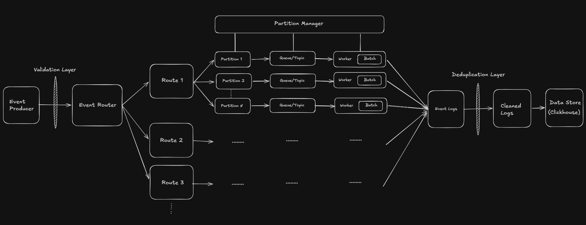

# Event Ingestion Service

Event ingestion pipeline for a ClickHouse-powered analytics platform inspired by CleverTap.

This repository is responsible for generating, simulating, and ingesting application events that power the complete analytics system.

---

## System Architecture

```text
┌──────────────────────────────┐
│      Event Ingestion         │
│      (This Repository)       │
└──────────────┬───────────────┘
               │
               ▼
┌──────────────────────────────┐
│      ClickHouse (Docker)     │
│   Events + Materialized      │
│           Views              │
└──────────────┬───────────────┘
               │
               ▼
┌──────────────────────────────┐
│        Analytics API         │
│         Spring Boot          │
└──────────────┬───────────────┘
               │
               ▼
┌──────────────────────────────┐
│      Analytics Dashboard     │
│          Vue + TS            │
└──────────────────────────────┘
```

### Related Repositories

- [Analytics API](https://github.com/Umang-Shroff/analytics-api)
- [Analytics Dashboard](https://github.com/Umang-Shroff/event-dashboard)

---

## Ingestion Pipeline

The event ingestion service follows a multi-stage processing pipeline designed to simulate large-scale analytics systems.

```text
Event Generator
        │
        ▼
Event Router
        │
        ▼
Partition Manager
        │
        ▼
Partition Queues
        │
        ▼
Worker Threads
        │
        ▼
Batch Builder
        │
        ▼
ClickHouse Writer
```

### Event Router

Routes incoming events to the appropriate partition based on the routing strategy.

### Partition Manager

Maintains multiple partitions to distribute event processing workload.

### Partition Queues

Buffers incoming events before processing.

### Worker Threads

Dedicated workers consume events from partitions independently.

### Batch Processing

Events are grouped into batches before database insertion to improve throughput.

### ClickHouse Writer

Persists processed events into ClickHouse for downstream analytics.

---



---

## Responsibilities

This service acts as the entry point of the analytics platform and is responsible for:

- Event generation
- Event ingestion
- User activity simulation
- Multi-tenant event generation
- Purchase and revenue events
- Campaign events
- Device metadata generation
- Partition assignment
- ClickHouse persistence

---

## Event Schema

Each generated event contains:

| Field          | Description                   |
| -------------- | ----------------------------- |
| eventId        | Unique event identifier       |
| tenantId       | Tenant/application identifier |
| userId         | User generating the event     |
| productId      | Associated product            |
| eventType      | Event category                |
| eventTimestamp | Event creation time           |
| partitionId    | Simulated partition           |
| payload        | Event metadata                |
| amount         | Revenue amount                |
| device         | User device                   |
| campaignId     | Campaign identifier           |

---

## Supported Event Types

- PAGE_VIEW
- CLICK
- ADD_TO_CART
- PURCHASE
- LOGIN
- LOGOUT

---

## Technology Stack

- Java
- Maven
- JDBC
- ClickHouse
- Docker

---

## Position in the Platform

This repository produces the raw events that drive the entire analytics ecosystem.

Generated events are stored in ClickHouse, aggregated through materialized views, exposed through Spring Boot APIs, and visualized inside the analytics dashboard.

## Sample Event

```json
{
  "eventId": 1001,
  "tenantId": "tenant-1",
  "userId": "user-42",
  "productId": "product-17",
  "eventType": "PURCHASE",
  "eventTimestamp": "2026-06-20T15:45:12.421",
  "partitionId": 3,
  "amount": 799.0,
  "device": "android",
  "campaignId": "summer-sale"
}
```

## Quick Start

```bash
git clone https://github.com/username/event-ingestion

cd event-ingestion

mvn clean install

mvn exec:java
```
